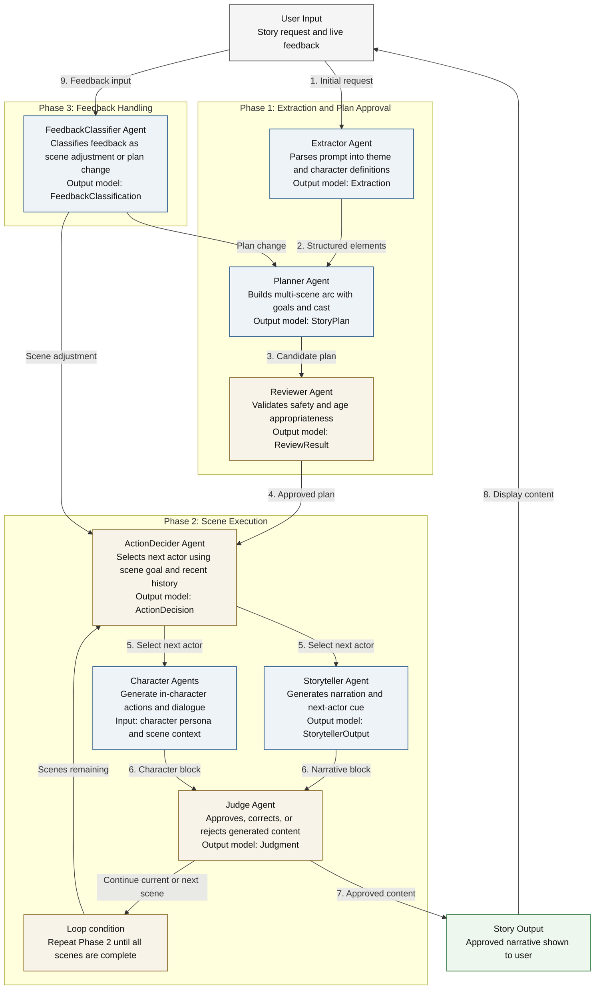

# Multi-Agent Storytelling System Architecture

This diagram shows the end-to-end flow and embeds each agent's role directly in the node label for quick reading.

```mermaid
flowchart TD
    classDef user fill:#f5f5f5,stroke:#555,stroke-width:1.2px,color:#111
    classDef process fill:#eef3f8,stroke:#2f5d8a,stroke-width:1.2px,color:#111
    classDef control fill:#f8f3e8,stroke:#8a6d2f,stroke-width:1.2px,color:#111
    classDef output fill:#edf7ed,stroke:#2f7a3d,stroke-width:1.2px,color:#111

    User[User Input\nStory request and live feedback]:::user

    subgraph P1[Phase 1: Extraction and Plan Approval]
        Extractor[Extractor Agent\nParses prompt into theme and character definitions\nOutput model: Extraction]:::process
        Planner[Planner Agent\nBuilds multi-scene arc with goals and cast\nOutput model: StoryPlan]:::process
        Reviewer[Reviewer Agent\nValidates safety and age appropriateness\nOutput model: ReviewResult]:::control
    end

    subgraph P2[Phase 2: Scene Execution]
        Director[ActionDecider Agent\nSelects next actor using scene goal and recent history\nOutput model: ActionDecision]:::control
        Storyteller[Storyteller Agent\nGenerates narration and next-actor cue\nOutput model: StorytellerOutput]:::process
        Characters[Character Agents\nGenerate in-character actions and dialogue\nInput: character persona and scene context]:::process
        Judge[Judge Agent\nApproves, corrects, or rejects generated content\nOutput model: Judgment]:::control
        SceneLoop[Loop condition\nRepeat Phase 2 until all scenes are complete]:::control
    end

    subgraph P3[Phase 3: Feedback Handling]
        Feedback[FeedbackClassifier Agent\nClassifies feedback as scene adjustment or plan change\nOutput model: FeedbackClassification]:::process
    end

    Output[Story Output\nApproved narrative shown to user]:::output

    User -->|1. Initial request| Extractor
    Extractor -->|2. Structured elements| Planner
    Planner -->|3. Candidate plan| Reviewer
    Reviewer -->|4. Approved plan| Director

    Director -->|5. Select next actor| Storyteller
    Director -->|5. Select next actor| Characters
    Storyteller -->|6. Narrative block| Judge
    Characters -->|6. Character block| Judge
    Judge -->|Continue current or next scene| SceneLoop
    SceneLoop -->|Scenes remaining| Director
    Judge -->|7. Approved content| Output

    Output -->|8. Display content| User
    User -->|9. Feedback input| Feedback
    Feedback -->|Scene adjustment| Director
    Feedback -->|Plan change| Planner
```
