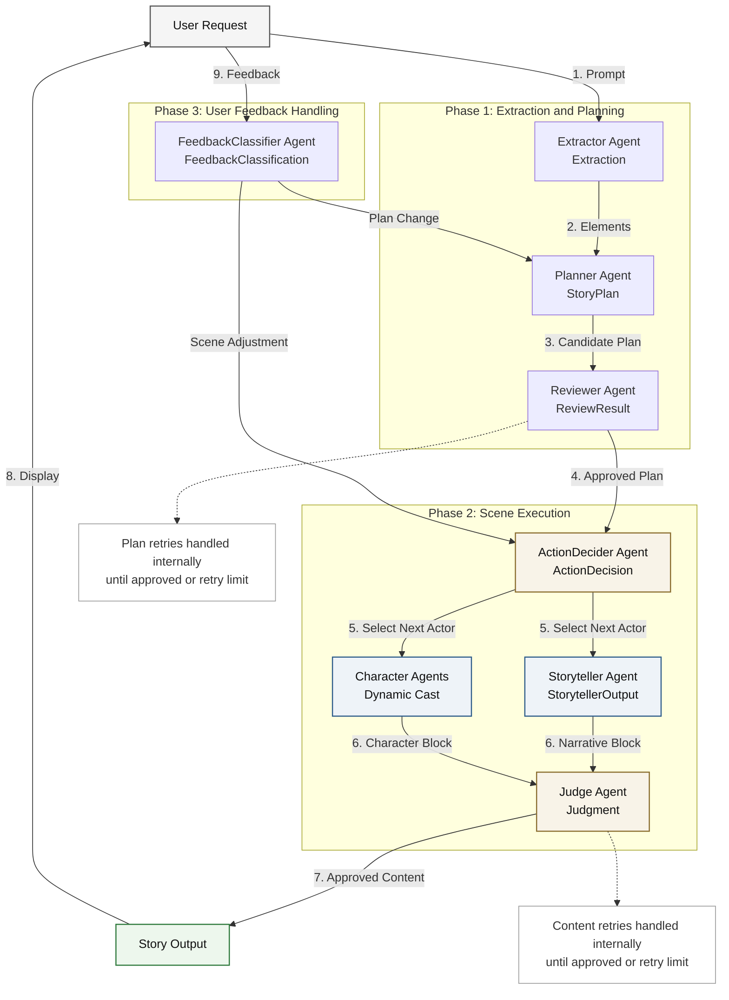

# Multi-Agent Storytelling System Architecture

This diagram illustrates the multi-agent architecture and the flow of structured data within the bedtime storytelling system.

## Agent Roles & Data Structures

All interactions are strictly typed using **Pydantic** to guarantee structural reliability when parsed by the OpenAI Responses API.

*   **Extractor Agent:** Analyzes the user's initial prompt and extracts elements into an `Extraction` model containing a strict Enum for the theme, detailed character descriptions, and relationships.
*   **Planner Agent:** Adopts a specific author persona (e.g., Dan Brown, J.K. Rowling) based on the theme to generate a 9-scene Hero's Journey arc, returning a `StoryPlan`.
*   **Reviewer Agent:** A safety gatekeeper that evaluates the `StoryPlan` for 5-10-year-old age appropriateness (e.g., converting violent threats to safe scares). Returns a `ReviewResult`.
*   **ActionDecider (Director) Agent:** Evaluates the ongoing story context and determines which entity (the Storyteller or a specific Character) should speak next. Returns an `ActionDecision`.
*   **Storyteller Agent:** Acts as the narrator. Outputs a `StorytellerOutput` containing both the prose (`narrative_block`) and a hidden prompt instructing the next character (`prompt_for_next_actor`).
*   **Character Agents:** Independent agents initialized with the extracted personas. They generate seamless third-person prose matching their character description.
*   **Judge Agent:** A continuous quality control filter. Evaluates every piece of prose for safety, engagement, and alignment, returning a `Judgment`.
*   **FeedbackClassifier Agent:** Evaluates mid-story user input, classifying it as a localized "scene adjustment" or a major "plan change" via the `FeedbackClassification` model.
